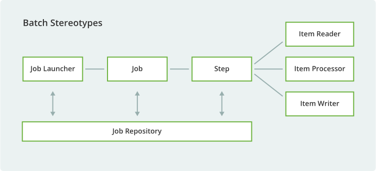
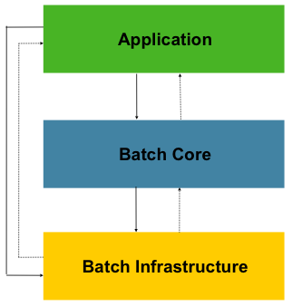
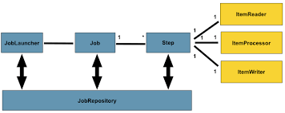
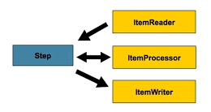
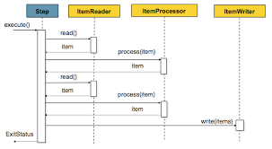
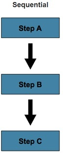
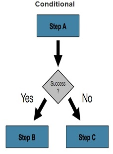
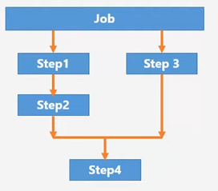
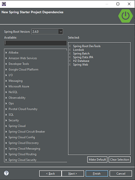

# Data batch processing Spring Batch

# Introduction

* Une infrastructure de traitement par lots legere et complete.
* Concue pour permettre le developpement d'applications par lots robustes et vitales pour les operations quotidiennes des systemes d'entreprise.
* Spring Batch fournis des fonctions reutilisables essentielles au traitement de grands volumes d'enregistrements, notamment.
* Il fournis egalement des fonctionnalites et des services techniques plus avances qui permettront d'effectuer les traitements par lots extremement volumineux et tres performants grace a des techniques d'optimisatio et de partitionnement.


## Scenario d'utilisation

Un programme batch typique generalement:

* Lit un grand nombre d'enregistrements dans une base de donnees, un fichier ou une file d'attente.
* Traite les donnees d'une certaine maniere.
* Ecrit les donnees sous une forme modifiee.

Un traitements par lots font partie de la plutart des projets informatiques et Spring Batch est l'un des rares framework open source offrant une solution robuste a ll'echelle de l'entreprisee.




## Cas utilisateurs cote metier (Uses case)

* A la fin de chaque mois, une entreprise doit envoyer les virements des salaires des employes dans leurs comptes respectifs.
* Le traitement des bulletins de salaire a la fin du mois.
* Envoi de courriels de communication de masse.
* Generer des rapports automatises sur une base quotidienne, hebdomadaire ou mensuelle.
* Execution automatique du flux de travail sans intervention humaine.
* Commit le traitement par lots periodiquement.
* Traitement par lots massivement parallele.

## Cas utilisateurs cote techniques (Uses caes)

* Pour l'execution automatique de tests a une frequence definie.
* Effectuer des mises a jour automatiques de la base de donnees a une frequence predefinie.
* Il peut etre utilise avec un systeme de file d'attente pour traiter un nombre considerable de transaction sans echecs.
* Peut etre utilise avec les API pour effectuer des taches telles que :
 * Le controle de l'integrite du serveur ou de l'application.
 * La generation de donnees factices pour le test de charge, etc.
 
## Architrecture de spring batch
  

 
Cette architecture en couches met en evidence 3 principaux composants de haut niveau:

* Application:
	* Contient tous les traitements par lots et le code personnalise ecrits par les developpeurs a l'aide de Spring Batch
 
* Batch Core:
	* Le noyau de lot contient les classes d'execution principales necessaires au lancement et au controle d'un traitement par lots. Il comprend des implementations pour **jobLauncher, Job et Step**

* Batch infrastructure:
	* Application et Batch Core sont tous les deux construits sur une infrastructure commune. Cette infrastructure contient des **Readers, des Writers et des services de traitement courants**
 
## Concepts fondamentaux de Spring Batch



Un traitement par lots est generalement encapsule par:

* Un **job** comportant plusieurs **Step**
* Chaque **Step** a generalement un seul **ItemReader, ItemProcessor et ItemWriter**
* Un job est execute par un **JobLauncher**
* Les metadonnees relatives aux traitements configures et executes sont stockees dans un **JobRepository**

# Job


 
* Un job est une entite qui encapsule un  processus de traitement par lots complet.
* Comme c'est le cas avec d'autre projets Spring, un Job est associe a:
	* Un fichier de configuration XML
	* Une classe configuration Java
* Un **Job** est simplement un **conteneur** pour les instances **Step**.
* A chaque job peut etre associe a plusieurs **JobInstances**, chacune etant definie d emaniere unique par ses **JobParameters** particuliers utilises pour demarrer un travail par lots.
* Chaque execution d'un **JobInstance** est appelee **JobExecution**
* Chaque **JobExecution** suit generralement ce qui s'est passe lors d'une execution, tels que des statuts actuel et de sortie, les heures de debut et de fin etc.

# Step


 
* Un **Step** est une phase specifique et independante d'un travail par lots, de sorte que chaque travail est compose d'une ou plusieurs etapes.

* Chaque step utilise:
	* Un **ItemReader** permettant de lire et deserialiser les enregistrements du batch a partir d'une entree quelconque.
	* Un **ItemProcessor** permettant de ttraiter les items transmis ItemReader.
	* Un **ItemWriter** permettant d'ecrire les enregistrements traites par ItemProcessor dans une sortie quelconques.
 

# StepConfiguration : Chunk Oriented Processing (Traitement oriente bloc)



[Step Configuration sur Spring Doc References](https://docs.spring.io/spring-batch/docs/4.1.x/reference/html/step.html#configureStep)

* Spring Batch utilise le modele "Chunk-oriented" processing.
* Le traitement oriente par morceaux consiste a lire les donnees une par une et a creer des "morceaux" ecrits dans une transaction.
* Un element est lu a partir d'un ItemReader, remis a un ItemProcessor et egrege.
* Une fois que le nombre d'elements lus est egal a l'intervalle de validation, l'element complet est ecrit par ItemWriter, puis la transaction est validee. 

Code de fonctionnement, dans Spring Batch:

```java
int nbresDeDonnees = 100;
List items = new ArrayList();
for(int i = 0; i < nbresDeDonnees; i++) {
	Object item = itemReader.read();
	Object processedItem = itemProcessor.process(item);
	items.add(processedItem);
}
itemWriter.write(items);
```

## Exemple de configuration d'un Job (avec un seul step)

```java
@Autowired
private JobBuilderFactory jobBuilderFactory;
@Autowired
private StepBuilderFactory stepBuilderFactory;
@Autowired
private ItemReader<BankTransaction> bankTransactionItemReader;
@Autowired
private ItemWriter<BankTransaction> bankTransactionItemWriter
@Autowired
private ItemProcessor<BankTransaction> itemProcessor;

@Bean
public Job job () {

	Step step = stepBuilderFactory.get("ETL-Transaction-File-Load")
		.<BankTransaction,BankTransaction>chunck(100) // type attendu en entre et sortie (BankTransaction)
		.reader(bankTransactionItemReader)
		.writer(bankTransactionItemWriter)
		.processor(itemProcessor)
		.build();
		
	return jobBuilderFactory.get("ETL-Load").start(step).build();
}
```

# Controle les flux des Steps



```java
@Bean
public Job job(){
	return this.jobBuilderFactory.get("job")
		.start(StepA())
		.next(StepB())
		.next(StepC())
		.build();
}
```



```java
@Bean
public Job job(){
	return this.jobBuilderFactory.get("job")
		.start(StepA())
		.on("*").to(stepB())
		.from(stepA()).on("FAILED").to(stepC())
		.end()
		.build();
}

@Bean
public Job job(){
	return this.jobBuilderFactory.get("job")
		.start(StepA())
		.next(StepB())
		.next(StepC())
		.build();
}
```



```java
@Bean
public Job job(){
	Flow flow1 = new FlowBuilder<SimpleFlow>("flow1")
		.start(step1())
		.next(step2())
		.build();
		
	Flow flow2 = new FlowBuilder<SimpleFlow>("flow2")
		.start(step3())
		.build();
	
	return this.jobBuilderFactory.get("job")
		.start(flow1)
		.split(new SimpleAsyncTaskExecutor()) // execute un autre thread en parallel
		.add(flow2)
		.next(step4())
		.end()
		.build();
}
```

# ItemReader

ItemReader est un moyen qui permet de fournir des donnees a partir d'une entree quelconque:

* Fichier plat (Flat File)
* XML file
* JSON file
* Base de donnees

```java
public interface ItemReader<T> {
	T read() <> throws Exception, UnexpectedInputException, ParseException, NonTransientResourceException;
} 

// Interface generic qui specifie le type de retour ici un objet de type T
```

## Validation des donnees d'entree: validation basee sur les annotations:API (JSR-303)

```java
@Data @ToString @NoArgsConstructor @AllArgsConstructor
public class BankTransaction {
	@Id
	private Long id;
	private long accountId;
	@Transient
	private String strDate;
	private Date transactionDate;
	@NotEmpty
	@Size(min=1, max=1) // Permet a transactionType de prendre minimum "1 caractere" ou maximum "1 caractere" de type String et ne saura pas vide
	private String transactionType;
	private double amount;
}
```

Pour pouvoir prendre en charge ces annotations de validations nous devons creer une classe BeanValidatingItemProcessor telquel:

```java
@Bean
public BeanValidatingItemProcessor<BankTransaction> beanValidatingItemProcessor() throws Exception{
	BeanValidatingItemProcessor<BankTransaction> beanValidatingItemProcessor = new BeanValidatingItemProcessor<>();
	beanValidatingItemProcessor.setFilter(true);
	return beanValidatingItemProcessor;
}
```

Cette classe permet de valider les donnees de BankTransaction.

# ItemWriter

Recoit un objet en entree et permet d'ecrire ces donnees a un endrois (base de donnees, fichier plat ...)

```java
public interface ItemWriter<T> {
	void write(List<? extends T> items) throws Exception;
} 

// Interface generic qui prend en parametre une List 
```

# ItemProcessor

Prend un objet en entre et retourne un objet en sortie.

```java
public interface ItemProcessor <I,O> {
	o process(I item) throws Exception;
} 

```

Exemple:

```java

// Entre process
public class Foo{}

// sortie process
public class Bar{
	public Bar(Foo foo) {}
}

public class FooProcessor implements ItemProcessor<Foo,Bar>{
	public Bar process(Foo foo) throws Exception{
		// Convertie un Foo en Bar
		return new Bar(foo);
	}
}

public class BarWriter implements ItemWriter<Bar>{
	public void write(List<? extends Bar> bars) throws Exception {
		// Ecriture de bars
	}
}
```

## Enchainement d'ItemProcessors

* Effectuer une seule transformation est utile dans de nombreux scenarios, mais que se passe-t-il si vous souhaitez «enchainer» plusieurs implementations ItemProcessor ?

* Ceci peut etre accompli en utilisant le modele composite.

* Pour mettre a jour la transformation precedente unique, par exemple, Foo est transforme en Bar, qui est transforme en FoofBar et ecrit, comme indique dans l'exemple suivant:


```java

public class Foo{}

public class Bar{
	public Bar(Foo foo) {}
}

public class Foobar{
	public Foobar(Bar bar) {}
}

public class FooProcessor implements ItemProcessor<Foo,Bar>{
	public Bar process(Foo foo) throws Exception{
		// Convertie un Foo en Bar
		return new Bar(foo);
	}
}

public class BarProcessor implements ItemProcessor<Bar,Foobar>{
	public Foobar process(Bar bar) throws Exception {
		return new Foobar(bar);
	}
}

public class FoobarWriter implements ItemWriter<Foobar>{
	public void write(List<? extends Foobar> items) throws Exception {
		// Ecriture de bars
	}
	
}
```

Puis pour le configurer.

```java
@Bean
public Job ioSampleJob() {
	return this.jobBuilderFactory.get("ioSampleJob")
		.start(step1()).end().build();
}

@Bean
public Step step1(){
	return this.stepBuilderFactory.get("step1")
		.<String,String>chunk(2)
		.reader(fooReader())
		.processor(compositeProcessor())
		.writer(fooWriter()).build();
}

@Bean
public CompositeItemProcessor compositeItemProcessor () {
	List<ItemProcessor> delegates = new ArrayList<>(2);
	delegates.add(new FooProcessor());
	delegates.add(new BarProcessor());
	
	CompositeItemProcessor processor = new CompositeItemProcessor();
	
	processor.setDelagates(delegates);
	
	return processor;
}
```

# ExecutionContext

* ExecutionContext est un ensemble de paires cle-valeur contenant des informations qui sont etendues a StepExecution et JobExecution.
* Spring Batch conserve dans ExecutionContext, ce qui est utile dans les cas ou vous souhaitez redemarrer une execution par lots (par ex, lorsqu'une erreur fatale s'est produite, etc).
* Apres redemarrage, les valeurs du precedent ExecutionContext sont restaurees a parttir de la base de donnees et appliquees.

# JobRepository

* JobRepository est le mecanisme de Spring Batch qui rend toute cette persistance possible.
* Fournis des operations CRUD pour les instanciations JobLauncher, Job et Step.
* Une fois qu'un Job est lance, une JobExecution est obtenue a partir du repository et, au cours de l'execution, les instances StepExecution et JobExecution sont conservees dans le repository.


# Spring Batch Application

On souhaite creer une application qui permet l'automatisation du traitement des transactions financieres dont les donnees sont fournis par un fichier texte au format CSV dont le format est le suivant:

```csv
transaction_id,account_number,transaction_date,transaction_type,transaction_amount
540300,10025436,17/10/2018-09:44,D,10000.570
550100,56732344,18/10/2018-13:15,C,500.120
640333,33214566,18/10/2018-14:12,D,3400.12
```

Les donnes seront lues, traites pour etre stockees ensuite dans une base de donnees.

# Initialisation du projets

## Creation projet Spring

Projet utilisant Maven et Java 15.

Nous mettons les dependences suivantes dans notre projet Spring Boot:

* Spring Web : MVC rest Controller declencher un job etc...
* Spring Data JPA: SQL
* H2 Database: ase de donnees relationnel
* Lombok
* Spring Boot DevTools: permet de consulter le contenu de la base H2 a travail une IHM.
* Spring Batch





## Mise en place des ressources d'entree ici un fichier CSV

Dossier main/ressources, faire nouveau fchier data.csv et le completer.


## Creation des objets metiers BankTransaction.java

BankTransaction, package com.ruffin.bankspringbatch.dao. Annote @Entity
@Data @ToString @NoArgsConstructor @AllArgsConstructor. Et des attributs annotes @Id qui defini l'id de l'objet unique et @Transient qui permet de ne pas rendre persistant cette donnee.

## Creation de l'interface JPA Repository extends JpaRepository<BankTransaction, Long>

BankTransactionRepository, package com.ruffin.bankspringbatch.dao.

# Configuration Spring Batch

## Creation configuration d'un Job SpringBatchConfig.java

1 . Creation de la classe **SpringBatchConfig**, package com.ruffin.bankspringbatch.configuration. Annote @Configuration et @EnableBatchProcessing.

2 . **Configuration du job.**

```java
@Configuration
@EnableBatchProcessing
public class SpringBatchConfig {
	@Autowired
	private JobBuilderFactory jobBuilderFactory;
	@Autowired
	private StepBuilderFactory stepBuilderFactory;
	@Autowired
	private ItemReader<BankTransaction> bankTransactionItemReader;
	@Autowired
	private ItemWriter<BankTransaction> bankTransactionItemWriter;
	@Autowired
	private ItemProcessor<BankTransaction, BankTransaction> bankTransactionItemProcessor;

}
```

3 . **Defnition de la methode retournant un job.**

```java
public Job bankJob() {
	Step step1 = stepBuilderFactory.get("step-load-data")
			.<BankTransaction,BankTransaction>chunk(100)
			.reader(bankTransactionItemReader)
			.processor(bankTransactionItemProcessor)
			.writer(bankTransactionItemWriter)
			.build();
			
	return jobBuilderFactory.get("bank-data-load-job")
			.start(step1)
			.build();
};
```

4 . **Definition des objets ItemReader** que l'on defini avec des Bean. Ici FlatFileItemReader sera utilise pour notre fichier plat (csv).

Nous passerons en parametre de la methode FlatFileItemReader le path du fichier csv, afin de ne pas le mettre en dure dans le code nous mettrons le path dans le fichier de configuration application.properties.

application.properties

```properties
inputFile=classpath:/data.csv
```

Puis nous annoterons le parametre @Value("${inputFile}")Resource inputFile , avec Resource issu du pâckage Spring et non javax. On sautera (skip) la 1er ligne qui est l'entete du fichier csv.

```java
@Bean
public FlatFileItemReader<BankTransaction> fileItemReader(@Value("${inputFile}") Resource inputFile) {
	FlatFileItemReader<BankTransaction> fileItemReader = new FlatFileItemReader<>();
	fileItemReader.setName("FFIR1");
	fileItemReader.setLinesToSkip(1);
	fileItemReader.setResource(inputFile);
	fileItemReader.setLineMapper(lineMapper());
	return fileItemReader;
}
```

Puis definir la methode lineMapper(), qui definira la structure de noptre fichier plat (csv) entete, separateur .... Il est important de garder l'ordre des champs d'entete lors de leur affectation lors du setNames(). Remarque que l'on ne met pas les champs @Transient qui ne doivent pas etre pris e compte sur le mapping de la base de donnees.


```java
@Bean
public LineMapper<BankTransaction> lineMapper() {
	DefaultLineMapper<BankTransaction> lineMapper = new DefaultLineMapper<>();
	DelimitedLineTokenizer delimitedLineTokenizer = new DelimitedLineTokenizer();
	delimitedLineTokenizer.setDelimiter(",");
	delimitedLineTokenizer.setStrict(false);
	delimitedLineTokenizer.setNames("id","accountID","strTransactionDate","transactionType","amount");
	lineMapper.setLineTokenizer(delimitedLineTokenizer);
	BeanWrapperFieldSetMapper<BankTransaction> fieldSetMapper = new BeanWrapperFieldSetMapper<>();
	fieldSetMapper.setTargetType(BankTransaction.class);
	lineMapper.setFieldSetMapper(fieldSetMapper);
	return lineMapper;
}
```

5 . **Definition des objets ItemProcessor**

Il est recommande de creer une nouvelle classe.

BankTransactionProcessor, package com.ruffin.bankspringbatch.

```java
@Component
public class BankTransactionItemProcessor implements ItemProcessor<BankTransaction, BankTransaction> {

	private SimpleDateFormat dateFormat = new SimpleDateFormat("dd/MM/yyyy-HH:mm");

	@Override
	public BankTransaction process(BankTransaction bankTransaction) throws Exception {
		bankTransaction.setTransactionDate(dateFormat.parse(bankTransaction.getStrTransactionDate()));
		return bankTransaction;
	}

}
```

6 . **Definition de ItemWriter**

Il est recommande de creer une nouvelle classe.

BankTransactionItemWriter, package com.ruffin.bankspringbatch.

```java
@Component
public class BankTransactionItemWriter implements ItemWriter<BankTransaction> {
	@Autowired
	private BankTransactionRepository bankTransactionRepository;

	@Override
	public void write(List<? extends BankTransaction> itemsList) throws Exception {
		// enregistrement en base de donnee
		bankTransactionRepository.saveAll(itemsList);
	}
}

```

7 . **application.properties**

Dans le cas present, si on execute l'application, le job s'executera automatiquement. Nous desirons ajouter une propriete pour gerer cette execution car a terme cela sera gere par l'api rest (rest controller action pour demarrer le job).
Pour cela, dans le fichier application.properties indiquer:

application.properties

```properties
inputFile=classpath:/data.csv
spring.batch.job.enabled=false

```


